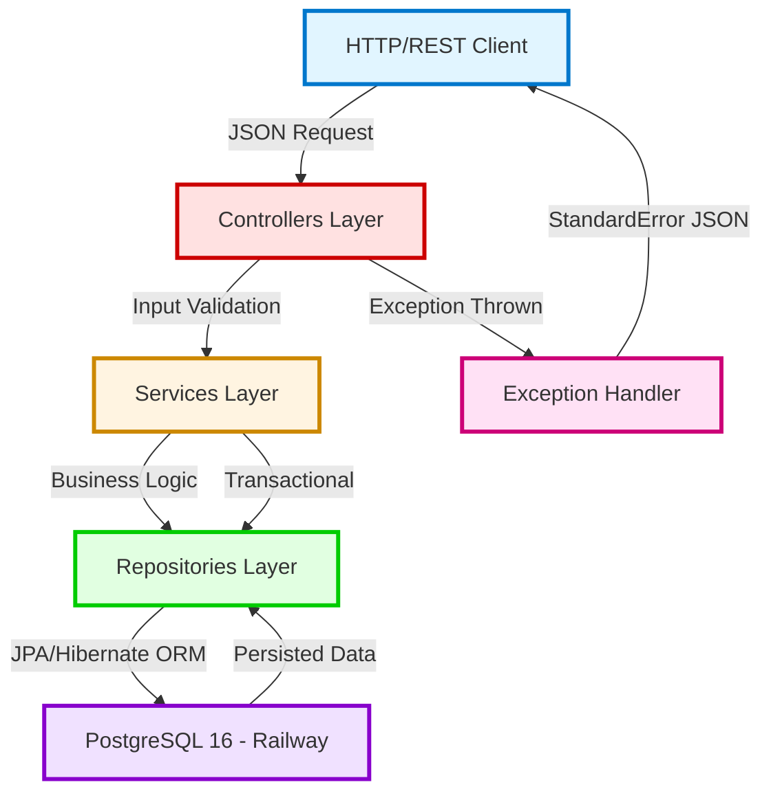

<div align="center">

# 💰 Finance API

### _Personal Finance Management Platform with Bleeding Edge Technologies_

[](https://openjdk.org/)
[](https://spring.io/projects/spring-boot)
[](https://www.postgresql.org/)
[](https://railway.app/)
[](https://swagger.io/)
[](https://choosealicense.com/licenses/mit/)

<br>

[](https://financeapi-production-cc70.up.railway.app/swagger-ui/index.html)

<br>

_High-performance RESTful API for personal finance management, built with the latest technologies in the Java ecosystem (2026)._

</div>

---

## 📢 About The Project

This project **explores the power of the modern Java ecosystem** (Java 25 + Spring Boot 4.0.2), demonstrating **high performance, clean code, and scalable architecture**. Developed with **the latest features available in the Java ecosystem in 2026**, this is not just a basic CRUD — it's a **complete platform** that exemplifies backend development best practices.

### 🎯 Technical Differentiators

- ⚡ **Java 25 (Latest Features)**: Leveraging the most recent language capabilities, including Virtual Threads, Record Patterns, Sequenced Collections, and Structured Concurrency
- 🚀 **Spring Boot 4.0.2**: State-of-the-art framework with performance optimizations and native support for Java 25 features
- 🏗️ **Layered Architecture**: Clear separation of concerns (Presentation → Business → Data Access)
- 🔒 **Robust Exception Handling**: Centralized handling with `@ControllerAdvice` and standardized responses
- 📊 **Multi-Environment Persistence**: PostgreSQL 16 in production, H2 in-memory for testing
- 🔗 **JPA Relationships**: Bidirectional entity relationships with proper data modeling
- 📚 **OpenAPI 3.0 Documentation**: Interactive Swagger interface for real-time testing
- ☁️ **Automated CI/CD**: Continuous deployment on Railway with zero downtime

---

## 🚀 Technology Stack

<table>
<thead>
<tr>
<th><b>Technology</b></th>
<th><b>Version</b></th>
<th><b>Role in Project</b></th>
</tr>
</thead>
<tbody>
<tr>
<td></td>
<td><b>25 (Latest)</b></td>
<td>Base language with Virtual Threads, Record Patterns, Sequenced Collections, Structured Concurrency, and the most modern features of 2026</td>
</tr>
<tr>
<td></td>
<td><b>4.0.2</b></td>
<td>Modern framework with <b>performance improvements</b>, native Java 25 support, and Spring Framework 6.2</td>
</tr>
<tr>
<td></td>
<td>4.0.x</td>
<td>Persistence abstraction with declarative repositories and derived query support</td>
</tr>
<tr>
<td></td>
<td>6.6.x</td>
<td>High-performance ORM with optimizations for modern Java</td>
</tr>
<tr>
<td></td>
<td>16</td>
<td>Production relational database (Railway) with JSON, arrays, and advanced query support</td>
</tr>
<tr>
<td></td>
<td>2.2.x</td>
<td>In-memory database for automated testing (<code>test</code> profile)</td>
</tr>
<tr>
<td></td>
<td>2.8.5</td>
<td>Automatic Swagger/OpenAPI 3.0 documentation generation with Jakarta annotations</td>
</tr>
<tr>
<td></td>
<td>3.9.12</td>
<td>Build automation and dependency management</td>
</tr>
<tr>
<td></td>
<td>Latest</td>
<td>PaaS platform with managed PostgreSQL, CI/CD, and native HTTPS</td>
</tr>
</tbody>
</table>

> 💡 **Why Java 25 + Spring Boot 4?** This combination brings significant performance improvements, reduced startup time, native support for Virtual Threads and Structured Concurrency from Java 25, and optimized integration with modern observability ecosystems.

---

## 🧩 System Architecture

### Flow Diagram



### Application Layers

| Layer | Responsibility | Main Annotations |
|-------|----------------|------------------|
| **Presentation** | Receive HTTP requests, serialize/deserialize JSON, validate input | `@RestController`, `@RequestMapping`, `@GetMapping`, `@PostMapping` |
| **Business Logic** | Process business rules, orchestrate transactions, apply validations | `@Service`, `@Transactional` |
| **Data Access** | Persistence abstraction, SQL/JPQL queries, entity management | `@Repository`, `JpaRepository<T, ID>` |
| **Domain Model** | Represent business entities and their relationships | `@Entity`, `@Table`, `@ManyToOne`, `@OneToMany` |
| **Exception Handling** | Centralized exception capture and handling | `@ControllerAdvice`, `@ExceptionHandler` |

---

## 🔌 API Endpoints

### 👤 User Management (`/users`)

| Method | Endpoint | Description | Status Code |
|--------|----------|-------------|-------------|
| `GET` | `/users` | List all registered users | 200 OK |
| `GET` | `/users/{id}` | Find specific user by ID | 200 OK / 404 Not Found |
| `POST` | `/users` | Create new user | 201 Created |
| `PUT` | `/users/{id}` | Update existing user data | 200 OK / 404 Not Found |
| `DELETE` | `/users/{id}` | Remove user (checks referential integrity) | 204 No Content / 400 Bad Request |
| `GET` | `/users/{id}/expenses` | List all expenses for a user | 200 OK / 404 Not Found |

### 💳 Expense Management (`/expenses`)

| Method | Endpoint | Description | Status Code |
|--------|----------|-------------|-------------|
| `GET` | `/expenses` | List all registered expenses | 200 OK |
| `GET` | `/expenses/{id}` | Find specific expense by ID | 200 OK / 404 Not Found |
| `POST` | `/expenses` | Register new expense | 201 Created |
| `PUT` | `/expenses/{id}` | Update existing expense | 200 OK / 404 Not Found |
| `DELETE` | `/expenses/{id}` | Remove expense | 204 No Content / 404 Not Found |

---

## 📄 JSON Payload Examples

### Create New User

<details>
<summary><b>POST /users</b></summary>

**Request Body:**
```json
{
  "name": "João Dev",
  "email": "joao@tech.com"
}
```

**Response (201 Created):**
```json
{
  "id": 1,
  "name": "João Dev",
  "email": "joao@tech.com"
}
```

**Response Header:**
```
Location: https://financeapi-production-cc70.up.railway.app/users/1
```

</details>

### Register New Expense

<details>
<summary><b>POST /expenses</b></summary>

**Request Body:**
```json
{
  "description": "Executive Lunch - Italian Restaurant",
  "price": 125.50,
  "date": "2026-01-30T12:30:00Z",
  "user": {
    "id": 1
  }
}
```

**Response (201 Created):**
```json
{
  "id": 1,
  "description": "Executive Lunch - Italian Restaurant",
  "price": 125.50,
  "date": "2026-01-30T12:30:00Z",
  "user": {
    "id": 1,
    "name": "João Dev",
    "email": "joao@tech.com"
  }
}
```

**Response Header:**
```
Location: https://financeapi-production-cc70.up.railway.app/expenses/1
```

</details>

### Update Existing Expense

<details>
<summary><b>PUT /expenses/{id}</b></summary>

**Request Body:**
```json
{
  "description": "Executive Lunch - Updated Amount",
  "price": 135.00,
  "date": "2026-01-30T13:00:00Z"
}
```

**Response (200 OK):**
```json
{
  "id": 1,
  "description": "Executive Lunch - Updated Amount",
  "price": 135.00,
  "date": "2026-01-30T13:00:00Z",
  "user": {
    "id": 1,
    "name": "João Dev",
    "email": "joao@tech.com"
  }
}
```

</details>

### List User's Expenses

<details>
<summary><b>GET /users/{id}/expenses</b></summary>

**Response (200 OK):**
```json
[
  {
    "id": 1,
    "description": "Executive Lunch",
    "price": 125.50,
    "date": "2026-01-30T12:30:00Z",
    "user": {
      "id": 1,
      "name": "João Dev",
      "email": "joao@tech.com"
    }
  },
  {
    "id": 2,
    "description": "Uber - Home → Office",
    "price": 28.00,
    "date": "2026-01-30T08:15:00Z",
    "user": {
      "id": 1,
      "name": "João Dev",
      "email": "joao@tech.com"
    }
  },
  {
    "id": 3,
    "description": "Breakfast - Bakery",
    "price": 15.50,
    "date": "2026-01-30T07:45:00Z",
    "user": {
      "id": 1,
      "name": "João Dev",
      "email": "joao@tech.com"
    }
  }
]
```

</details>

### Error Handling

<details>
<summary><b>Example 404 Error - Resource Not Found</b></summary>

**Request:**
```
GET /users/9999
```

**Response (404 Not Found):**
```json
{
  "timestamp": "2026-01-30T15:45:30Z",
  "status": 404,
  "error": "Resource not found!",
  "message": "Resource not found id: 9999",
  "path": "/users/9999"
}
```

</details>

---

## 📦 How to Run the Project

### Prerequisites

- ☕ **Java 25** or higher ([Download OpenJDK](https://openjdk.org/projects/jdk/25/))
- 📦 **Maven 3.9+** (or use the included wrapper: `./mvnw`)
- 🐳 **Docker** (optional, for containerization)
- 🐘 **PostgreSQL 16** (for local production environment)

---

### 🐳 Option 1: Running with Docker (Recommended)

```bash
# Clone the repository
git clone https://github.com/JoaoGuilhermmy/finance_API.git
cd finance_API

# Build the Docker image
docker build -t finance-api:latest .

# Run the container (configure environment variables)
docker run -p 8080:8080 \
  -e PGHOST=your-postgresql-host \
  -e PGPORT=5432 \
  -e PGDATABASE=finance-db \
  -e PGUSER=your-username \
  -e PGPASSWORD=your-secure-password \
  finance-api:latest
```

---

### ⚙️ Option 2: Running with Maven (Local Development)

#### 🧪 Test Mode (H2 In-Memory Database)

```bash
# Clone the repository
git clone https://github.com/JoaoGuilhermmy/finance_API.git
cd finance_API

# Run with test profile
./mvnw spring-boot:run -Dspring-boot.run.profiles=test

# Access the application
# 🌐 API Base: http://localhost:8080
# 🗄️ H2 Console: http://localhost:8080/h2-console
# 📚 Swagger UI: http://localhost:8080/swagger-ui/index.html
```

**H2 Console Settings:**
```
JDBC URL: jdbc:h2:mem:testdb
User Name: sa
Password: (leave blank)
```

---

#### 🚀 Production Mode (PostgreSQL)

```bash
# Configure environment variables
export PGHOST=localhost
export PGPORT=5432
export PGDATABASE=finance-db
export PGUSER=postgres
export PGPASSWORD=your-secure-password

# Compile and run the application
./mvnw clean package -DskipTests
./mvnw spring-boot:run

# Access Swagger UI
# 📚 http://localhost:8080/swagger-ui/index.html
```

---

### 🔐 Environment Variables Configuration

To run in local production, configure the following environment variables:

```bash
# PostgreSQL Connection
PGHOST=your-postgresql-host          # Example: localhost or server IP
PGPORT=5432                          # PostgreSQL default port
PGDATABASE=finance-db                # Database name
PGUSER=your-username                 # PostgreSQL user
PGPASSWORD=your-secure-password      # User password
```

**Method 1: `.env` file (recommended for development)**

Create a `.env` file in the project root:

```bash
PGHOST=localhost
PGPORT=5432
PGDATABASE=finance-db
PGUSER=postgres
PGPASSWORD=YourStrongPassword123!
```

**Method 2: Direct export in terminal**

```bash
export PGHOST=localhost
export PGPORT=5432
export PGDATABASE=finance-db
export PGUSER=postgres
export PGPASSWORD=YourStrongPassword123!
```

> ⚠️ **Critical Security**: 
> - Never commit `.env` files or credentials to Git
> - Add `.env` to `.gitignore`
> - Use secret management services in production (AWS Secrets Manager, HashiCorp Vault, etc.)

---

## ☁️ Production Deployment (Railway)

The application is currently **hosted on Railway**, a modern deployment platform with the following features:

### ✨ Railway Features

- ✅ **Fully Automated CI/CD**: Automatic deployment on every push to `main` branch
- ✅ **Managed PostgreSQL 16**: Database provisioned and maintained automatically
- ✅ **Native HTTPS**: SSL/TLS certificates managed by the platform
- ✅ **Real-Time Logs**: Complete monitoring via dashboard
- ✅ **Instant Rollback**: Roll back to previous versions with one click
- ✅ **Secure Environment Variables**: Integrated secret management
- ✅ **Auto-scaling**: Horizontal scaling based on demand

### 🌐 Access Production Application

**Base URL:** [https://financeapi-production-cc70.up.railway.app](https://financeapi-production-cc70.up.railway.app/swagger-ui/index.html)  
**Swagger UI:** [https://financeapi-production-cc70.up.railway.app/swagger-ui/index.html](https://financeapi-production-cc70.up.railway.app/swagger-ui/index.html)

### ⚙️ Deployment Configuration

| Setting | Value |
|---------|-------|
| **Runtime** | Java 25 (OpenJDK) |
| **Build Command** | `mvn clean package -DskipTests` |
| **Start Command** | `java -jar target/finance-api-0.0.1-SNAPSHOT.jar` |
| **Port** | 8080 (auto-detected) |
| **Database** | PostgreSQL 16 (managed) |
| **Region** | US West |

---

## 🧪 Testing

```bash
# Run all tests
./mvnw test

# Run tests with detailed report
./mvnw test -Dtest=* --debug

# Run with coverage (requires JaCoCo plugin)
./mvnw clean test jacoco:report

# Coverage report at: target/site/jacoco/index.html
```

---

## 📚 Interactive Documentation (Swagger/OpenAPI)

The entire API is documented with **Swagger/OpenAPI 3.0**. Access the interactive interface:

- **🌐 Production**: [https://financeapi-production-cc70.up.railway.app/swagger-ui/index.html](https://financeapi-production-cc70.up.railway.app/swagger-ui/index.html)
- **💻 Local**: `http://localhost:8080/swagger-ui/index.html`

### 🎯 Swagger UI Features

- ✅ View all available endpoints organized by tags
- ✅ Test HTTP requests directly in the browser
- ✅ See complete schemas of data models (DTOs/Entities)
- ✅ Check HTTP response codes and examples
- ✅ Integrated authentication (when enabled)
- ✅ Download OpenAPI specification in JSON/YAML

---

## 🛠️ Applied Technologies and Patterns

### Architecture & Design Patterns

- ✅ **Layered Architecture** (Presentation → Business → Data → Domain)
- ✅ **Repository Pattern** via Spring Data JPA
- ✅ **Dependency Injection** with Inversion of Control (IoC)
- ✅ **DTO Pattern** (implicit via serializable JPA entities)

### Code Best Practices

- ✅ **REST API** with semantic HTTP verbs (GET, POST, PUT, DELETE)
- ✅ **Correct HTTP Status Codes** for each operation
- ✅ **Centralized Exception Handling** with `@ControllerAdvice`
- ✅ **Multi-layer Data Validation**
- ✅ **Spring Profiles** for environments (test, dev, prod)

### Persistence & Database

- ✅ **JPA/Hibernate** for ORM
- ✅ **Bidirectional Relationships** with `@JsonIgnore` to avoid loops
- ✅ **Auto-increment IDs** with `GenerationType.AUTO` strategy
- ✅ **ISO 8601 Timestamps** with `Instant` and `@JsonFormat`
- ✅ **Managed Transactions** with `@Transactional`

---

## 📁 Project Structure

```
finance_API/
│
├── src/
│   ├── main/
│   │   ├── java/com/joaoguilhermmy/finance/
│   │   │   ├── config/                        # Application configurations
│   │   │   │   ├── OpenApiConfig.java         # Swagger/OpenAPI configuration
│   │   │   │   └── TesteConfig.java           # Test data seeding
│   │   │   │
│   │   │   ├── entities/                      # Domain models (JPA Entities)
│   │   │   │   ├── User.java                  # User entity
│   │   │   │   └── Expense.java               # Expense entity
│   │   │   │
│   │   │   ├── repositories/                  # Data access layer
│   │   │   │   ├── UserRepository.java        # User repository
│   │   │   │   └── ExpenseRepository.java     # Expense repository
│   │   │   │
│   │   │   ├── services/                      # Business logic
│   │   │   │   ├── UserService.java           # User service
│   │   │   │   ├── ExpenseService.java        # Expense service
│   │   │   │   └── exception/                 # Custom exceptions
│   │   │   │       ├── ResourceNotFoundExcepetion.java
│   │   │   │       └── DatabaseExcepition.java
│   │   │   │
│   │   │   ├── resources/                     # REST Controllers
│   │   │   │   ├── UserResource.java          # User endpoints
│   │   │   │   ├── ExpenseResource.java       # Expense endpoints
│   │   │   │   └── exception/                 # Exception handlers
│   │   │   │       ├── ResourceExceptionHandler.java
│   │   │   │       └── StandardError.java
│   │   │   │
│   │   │   └── PersonalFinanceApiApplication.java  # Main class
│   │   │
│   │   └── resources/
│   │       ├── application.properties              # Production config
│   │       └── application-test.properties         # Test config
│   │
│   └── test/
│       └── java/com/joaoguilhermmy/finance/
│           └── PersonalFinanceApiApplicationTests.java
│
├── .mvn/                                      # Maven Wrapper
├── pom.xml                                    # Maven dependencies
├── .gitignore                                 # Git ignored files
├── LICENSE                                    # MIT License
└── README.md                                  # Project documentation
```

---

## 🤝 Author & Contact

<div align="center">

### João Guilhermmy

**Backend Developer | Java & Spring Specialist**

[](https://www.linkedin.com/in/joão-guilhermmy-93661b29b)
[](mailto:joaoguilhermmy2@gmail.com)
[](https://github.com/JoaoGuilhermmy)

</div>

---

## 📄 License

This project is under the MIT License. See the [LICENSE](LICENSE) file for more details.

---

<div align="center">

**⭐ If you found this project helpful, please consider giving it a star!**

Developed with ☕ and ❤️ by **João Guilhermmy**

</div>
