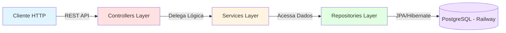

<div align="center">

# 💰 Finance API

### _Plataforma de Gestão Financeira Pessoal de Alta Performance_

[](https://openjdk.org/)
[](https://spring.io/projects/spring-boot)
[](https://www.postgresql.org/)
[](https://www.docker.com/)
[](https://railway.app/)
[](https://swagger.io/)

<br>

[](https://financeapi-production-cc70.up.railway.app/swagger-ui/index.html)

<br>

_API RESTful completa para gerenciamento de despesas pessoais, desenvolvida com arquitetura em camadas e deploy automatizado em produção._

</div>

---

## 📢 Sobre o Projeto

**Finance API** é uma solução robusta e escalável para gestão financeira pessoal, construída com as melhores práticas da engenharia de software moderna. Este não é apenas mais um CRUD — é uma **plataforma completa** que demonstra domínio de arquitetura, persistência de dados e deploy em nuvem.

### ✨ Principais Características

- 🏗️ **Arquitetura em Camadas**: Separação clara entre Controllers, Services e Repositories
- 🔒 **Validação Robusta**: Tratamento de exceções personalizado e respostas padronizadas
- 📊 **Persistência Confiável**: PostgreSQL em produção (Railway) e H2 para testes
- 🚀 **CI/CD Automatizado**: Deploy contínuo na Railway
- 📚 **Documentação Interativa**: Swagger/OpenAPI 3.0 integrado
- 🔗 **Relacionamentos JPA**: Modelagem de dados com entidades relacionadas (User ↔ Expense)
- ⚡ **Performance**: Spring Boot 4 com otimizações de última geração

---

## 🚀 Stack Tecnológica

<table>
<thead>
<tr>
<th><b>Tecnologia</b></th>
<th><b>Versão</b></th>
<th><b>Função no Projeto</b></th>
</tr>
</thead>
<tbody>
<tr>
<td></td>
<td>21</td>
<td>Linguagem principal com suporte a Records, Pattern Matching e Text Blocks</td>
</tr>
<tr>
<td></td>
<td>4.0.2</td>
<td>Framework base para criação de APIs REST e injeção de dependências</td>
</tr>
<tr>
<td></td>
<td>4.0.x</td>
<td>Abstração de persistência e repositórios declarativos</td>
</tr>
<tr>
<td></td>
<td>6.6.x</td>
<td>ORM para mapeamento objeto-relacional</td>
</tr>
<tr>
<td></td>
<td>16</td>
<td>Banco de dados relacional em produção (Railway)</td>
</tr>
<tr>
<td></td>
<td>2.2.x</td>
<td>Banco em memória para ambiente de testes (perfil test)</td>
</tr>
<tr>
<td></td>
<td>2.8.5</td>
<td>Geração automática de documentação Swagger/OpenAPI 3.0</td>
</tr>
<tr>
<td></td>
<td>3.9.12</td>
<td>Gerenciamento de dependências e build automation</td>
</tr>
<tr>
<td></td>
<td>Latest</td>
<td>Plataforma de deploy em nuvem com CI/CD integrado</td>
</tr>
</tbody>
</table>

---

## 🧩 Arquitetura do Sistema

### Diagrama de Fluxo



### Camadas da Aplicação

| Camada | Responsabilidade | Tecnologia |
|--------|------------------|------------|
| **Presentation** | Receber requisições HTTP, validar entrada, retornar respostas | `@RestController`, `@RequestMapping` |
| **Business Logic** | Processar regras de negócio, orquestrar operações | `@Service`, `@Transactional` |
| **Data Access** | Abstração de persistência, queries customizadas | `@Repository`, Spring Data JPA |
| **Domain Model** | Entidades de negócio e relacionamentos | `@Entity`, `@ManyToOne`, `@OneToMany` |

---

## 🔌 Endpoints da API

### 👤 Gerenciamento de Usuários (`/users`)

| Método | Endpoint | Descrição | Status Code |
|--------|----------|-----------|-------------|
| `GET` | `/users` | Lista todos os usuários | 200 OK |
| `GET` | `/users/{id}` | Busca usuário por ID | 200 OK / 404 Not Found |
| `POST` | `/users` | Cria novo usuário | 201 Created |
| `PUT` | `/users/{id}` | Atualiza usuário existente | 200 OK / 404 Not Found |
| `DELETE` | `/users/{id}` | Remove usuário | 204 No Content / 404 Not Found |
| `GET` | `/users/{id}/expenses` | Lista despesas do usuário | 200 OK / 404 Not Found |

### 💳 Gerenciamento de Despesas (`/expenses`)

| Método | Endpoint | Descrição | Status Code |
|--------|----------|-----------|-------------|
| `GET` | `/expenses` | Lista todas as despesas | 200 OK |
| `GET` | `/expenses/{id}` | Busca despesa por ID | 200 OK / 404 Not Found |
| `POST` | `/expenses` | Registra nova despesa | 201 Created |
| `PUT` | `/expenses/{id}` | Atualiza despesa existente | 200 OK / 404 Not Found |
| `DELETE` | `/expenses/{id}` | Remove despesa | 204 No Content / 404 Not Found |

### 📄 Exemplo de Payload

<details>
<summary><b>POST /expenses - Criar Despesa</b></summary>

```json
{
  "description": "Aluguel Janeiro",
  "price": 1200.00,
  "date": "2026-01-05T10:00:00Z",
  "user": {
    "id": 1
  }
}
```

</details>

<details>
<summary><b>POST /users - Criar Usuário</b></summary>

```json
{
  "name": "Maria Silva",
  "email": "maria@example.com"
}
```

</details>

---

## 📦 Como Rodar o Projeto

### Pré-requisitos

- **Java 21** ou superior ([Download](https://adoptium.net/))
- **Maven 3.9+** (ou use o wrapper incluído: `./mvnw`)
- **Docker** (opcional, para containerização)
- **PostgreSQL 16** (para ambiente de produção local)

### 🐳 Opção 1: Rodando com Docker (Recomendado)

```bash
# Clone o repositório
git clone https://github.com/JoaoGuilhermmy/finance_API.git
cd finance_API

# Construa a imagem Docker
docker build -t finance-api .

# Execute o container (PostgreSQL deve estar rodando)
docker run -p 8080:8080 \
  -e PGHOST=seu-host \
  -e PGPORT=5432 \
  -e PGDATABASE=finance-db \
  -e PGUSER=seu-usuario \
  -e PGPASSWORD=sua-senha \
  finance-api
```

### ⚙️ Opção 2: Rodando com Maven (Desenvolvimento Local)

#### Modo Teste (H2 Database em Memória)

```bash
# Clone o repositório
git clone https://github.com/JoaoGuilhermmy/finance_API.git
cd finance_API

# Execute com perfil de teste
./mvnw spring-boot:run -Dspring-boot.run.profiles=test

# Acesse a aplicação
# API: http://localhost:8080
# H2 Console: http://localhost:8080/h2-console
# Swagger: http://localhost:8080/swagger-ui/index.html
```

#### Modo Produção (PostgreSQL)

```bash
# Configure as variáveis de ambiente
export PGHOST=localhost
export PGPORT=5432
export PGDATABASE=finance-db
export PGUSER=postgres
export PGPASSWORD=sua-senha-segura

# Execute a aplicação
./mvnw spring-boot:run

# Acesse o Swagger
# http://localhost:8080/swagger-ui/index.html
```

### 🔐 Configuração de Variáveis de Ambiente

Para rodar em produção local, crie um arquivo `.env` ou configure as seguintes variáveis:

```bash
PGHOST=seu-postgresql-host
PGPORT=5432
PGDATABASE=finance-db
PGUSER=seu-usuario
PGPASSWORD=sua-senha
```

> ⚠️ **Importante**: Nunca commite credenciais sensíveis no repositório. Use variáveis de ambiente ou serviços de gerenciamento de secrets.

---

## ☁️ Deploy em Produção

### Railway Platform

A aplicação está atualmente hospedada na **Railway**, uma plataforma moderna de deploy com as seguintes características:

- ✅ **CI/CD Automatizado**: Deploy automático a cada push na branch `main`
- ✅ **PostgreSQL Gerenciado**: Banco de dados provisionado automaticamente
- ✅ **HTTPS Nativo**: Certificados SSL gerenciados pela plataforma
- ✅ **Logs em Tempo Real**: Monitoramento completo da aplicação
- ✅ **Rollback Instantâneo**: Versões anteriores sempre disponíveis

**URL de Produção**: [https://financeapi-production-cc70.up.railway.app](https://financeapi-production-cc70.up.railway.app/swagger-ui/index.html)

### Configurações do Railway

O deploy está configurado com as seguintes especificações:

- **Runtime**: Java 21
- **Build Command**: `mvn clean package -DskipTests`
- **Start Command**: `java -jar target/finance-api-0.0.1-SNAPSHOT.jar`
- **Healthcheck**: Endpoint `/actuator/health` (se habilitado)

---

## 🧪 Testes

```bash
# Executar todos os testes
./mvnw test

# Executar com cobertura
./mvnw clean test jacoco:report
```

---

## 📚 Documentação Interativa

Toda a API está documentada com **Swagger/OpenAPI 3.0**. Acesse a interface interativa:

- **Produção**: [https://financeapi-production-cc70.up.railway.app/swagger-ui/index.html](https://financeapi-production-cc70.up.railway.app/swagger-ui/index.html)
- **Local**: `http://localhost:8080/swagger-ui/index.html`

Na interface Swagger você pode:
- ✅ Visualizar todos os endpoints disponíveis
- ✅ Testar requisições diretamente no navegador
- ✅ Ver modelos de dados (schemas)
- ✅ Consultar códigos de resposta HTTP

---

## 🛠️ Tecnologias e Padrões Aplicados

- ✅ **REST API** com verbos HTTP semânticos
- ✅ **JPA/Hibernate** para ORM
- ✅ **DTOs implícitos** via entidades JPA
- ✅ **Exception Handling** centralizado com `@ControllerAdvice`
- ✅ **Profiles do Spring** (test, dev, prod)
- ✅ **Relacionamentos bidirecionais** com `@JsonIgnore`
- ✅ **Auto-incremento** de IDs com estratégia `AUTO`
- ✅ **Timestamps ISO 8601** com `Instant` e `@JsonFormat`

---

## 📁 Estrutura do Projeto

```
finance_API/
├── src/
│   ├── main/
│   │   ├── java/com/joaoguilhermmy/finance/
│   │   │   ├── config/           # Configurações (OpenAPI, perfis)
│   │   │   ├── entities/         # Modelos de domínio (User, Expense)
│   │   │   ├── repositories/     # Interfaces JPA
│   │   │   ├── resources/        # Controllers REST
│   │   │   ├── services/         # Lógica de negócio
│   │   │   └── PersonalFinanceApiApplication.java
│   │   └── resources/
│   │       ├── application.properties          # Config produção
│   │       └── application-test.properties     # Config testes
│   └── test/
│       └── java/                 # Testes unitários
├── pom.xml                       # Dependências Maven
└── README.md
```

---

## 🤝 Autor & Contato

<div align="center">

### João Guilhermmy

**Backend Developer | Java & Spring Specialist**

[](https://www.linkedin.com/in/joão-guilhermmy-93661b29b)
[](mailto:joaoguilhermmy2@gmail.com)
[](https://github.com/JoaoGuilhermmy)

</div>

---

## 📄 Licença

Este projeto foi desenvolvido para fins educacionais e de portfólio.

---

<div align="center">

**⭐ Se este projeto foi útil, considere dar uma estrela no repositório!**

Desenvolvido com ☕ e 💻 por [João Guilhermmy](https://github.com/JoaoGuilhermmy)

</div>
